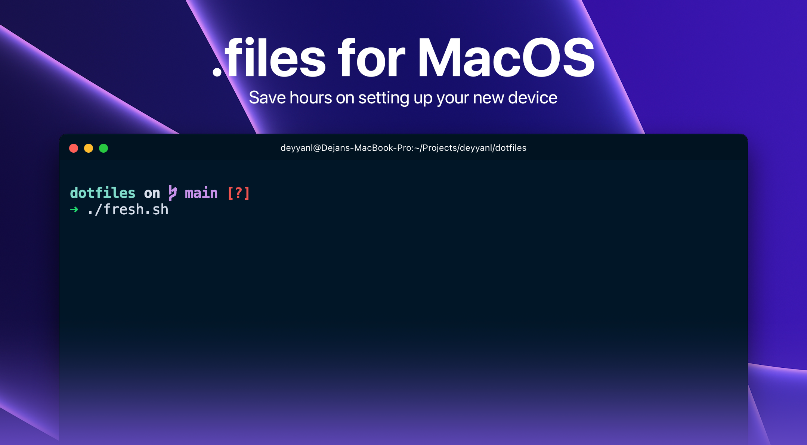

*Yeah, I know, missing bash there, looking better without it :P*

## Installation
🍹 For a fresh install
```sh
git clone https://github.com/deyyanl/dotfiles.git $HOME/.dotfiles && cd $HOME/.dotfiles && bash ./fresh.sh
```
(Clone the repo -> Change directory to `dotfile`, execute fresh setup and clone the repos)

🤓 Just download
```sh
git clone https://github.com/deyyanl/dotfiles.git $HOME/.dotfiles
```

Depending on your needs, you should configure `clone.sh` with respective links to the repos you want cloned, and if you actually need multiple directories (I like to organize them by clients). That's purely optional and up to you 😄
### Credits
- [lorisleiva/dotfiles](https://github.com/lorisleiva/dotfiles)
- [mathiasbynens/dotfiles](https://github.com/mathiasbynens/dotfiles)
- [driesvints/dotfiles](https://github.com/driesvints/dotfiles)